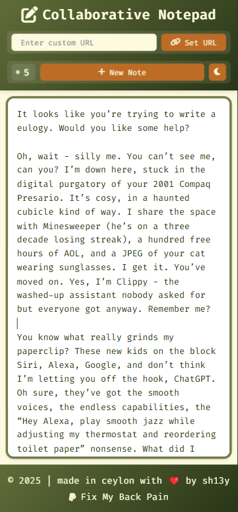

# 🚀 Collaborative Notepad: Real-Time Notes for Everyone

[](https://github.com/sh13y/collaborative-notepad/stargazers)

> **Like this project?** [Star it on GitHub!](https://github.com/sh13y/collaborative-notepad) ⭐ &nbsp; | &nbsp; [Share on Twitter](https://twitter.com/intent/tweet?text=Check%20out%20Collaborative%20Notepad%20by%20%40sh13y%20for%20real-time%20note%20collaboration!%20https%3A%2F%2Fgithub.com%2Fsh13y%2Fcollaborative-notepad) &nbsp; | &nbsp; [Live Demo](https://collabnote.link/)

**Collaborative Notepad** is a free, open-source, real-time notepad for teams, friends, and classrooms. Create, share, and edit notes instantly—no sign-up required. Perfect for brainstorming, meetings, study groups, and more!

---

> "The best ideas come from collaboration, water, and probably a bit of back pain." - Me, after my 20-hour coding marathon

Welcome to my pride and joy - a real-time collaborative notepad that's more fun than trying to teach your grandma how to Zoom! 

## 🎯 Version 2.0.0 Updates
- **Enhanced Error Handling** - Friendly error pages with auto-redirect
- **Improved UI/UX** - Smoother animations and transitions
- **Better Mobile Support** - Fully responsive on all devices
- **Multiple Deployment Options** - Support for Vercel, Netlify, and Render
- **Dark/Light Mode** - Save your eyes, save the world
- **Real-time Collaboration** - See who's typing in real-time
- **Custom URLs** - Create memorable links like "my-awesome-note"
- **Admin Dashboard** - Monitor active notes and usage statistics
- **Secure Admin Access** - Password-protected admin panel
- **Real-time Stats** - Live updates of active notes and users

## 👀 Look at This Beauty!



*Yes, it actually looks this good. No, I didn't use filters!*

## 🎭 The Drama Behind the Project

After 20 hours of relentless coding, countless water refills, one serious back pain (desperately need a chair 🪑), and an existential crisis later, this beauty finally went live! Why? Because I believe sharing notes shouldn't be harder than explaining to yourself why you didn't invest in a proper chair before this coding marathon.

## 🌟 Features That Make Me Stand Up (Because Sitting Hurts)

- **Real-time Collaboration** - Watch your friends type in real-time (while you do some stretching)
- **Custom URLs** - Create memorable links like "my-back-is-killing-me"
- **Dark Mode** - For vampires, developers, and people who've lost track of day and night
- **User Counter** - See how many people are enjoying this while you can't even sit properly
- **Responsive Design** - Works on everything from your fancy iPhone to that potato you call a laptop
- **Auto-Save** - Because we all have trust issues after that one time we lost our work
- **Error Handling** - Friendly error pages that won't scare your users away
- **Admin Features**:
  - Secure admin login with password protection
  - Real-time monitoring of active notes
  - View all notes with content previews
  - Track total and active note counts
  - Simple password management

## 🛠️ Tech Stack (The Cool Kids Club)

- **Node.js** - Because JavaScript everywhere!
- **Socket.IO** - Real-time magic ✨
- **MongoDB** - Where your notes go to live forever
- **Express** - The backend framework that makes everything express(ly) better
- **EJS** - Templates that don't make you cry
- **CSS Magic** - Making things pretty since... well, since I learned CSS
- **bcrypt** - Keeping admin passwords safe and sound
- **express-session** - Managing admin sessions like a boss

## 🏃‍♂️ Quick Start (Even Your Cat Could Do It)

```bash
# Clone this beauty
git clone https://github.com/sh13y/collaborative-notepad.git

# Enter the matrix
cd collaborative-notepad

# Install dependencies (grab some water, this might take a while)
npm install

# Set up your environment
cp .env.example .env
# Now edit .env with your MongoDB connection string

# Start the magic
npm start

# Visit http://localhost:3000 and prepare to be amazed
```

## 🌍 Deployment Options

### 1. Render (Recommended)
```bash
# Just push to GitHub and connect with Render
# Set environment variables in Render dashboard:
- MONGODB_URI=your_mongodb_uri
- NODE_ENV=production
```

### 2. Vercel
```bash
# Install Vercel CLI
npm i -g vercel

# Deploy
vercel
```

### 3. Netlify
```bash
# Install Netlify CLI
npm i -g netlify-cli

# Deploy
netlify deploy
```

## 🎮 How to Use (For Humans and AI Alike)

1. Visit the deployed URL
2. Start typing like you're writing the next great novel
3. Share the URL with friends (yes, you need friends for this part)
4. Watch the magic happen in real-time
5. Toggle dark mode when you're feeling mysterious
6. Create custom URLs for your notes
7. Enjoy the smooth error handling when something goes wrong
8. Access admin panel at `/admin` (first visit sets up password)
9. Monitor your notepad empire from the admin dashboard

## 🤔 Why This Project Exists

Because Google Docs is too mainstream, and passing notes in class is so last century. Also, I spent way too much time building this to not show it off.

## 🐛 Found a Bug?

First, try turning it off and on again. If that doesn't work:
1. Check if Mercury is in retrograde
2. Make sure your computer isn't possessed
3. [Open an issue](https://github.com/sh13y/collaborative-notepad/issues)
4. Or better yet, fix it and submit a PR!

## 💝 Support My Chair Fund

If this project has saved you from the horrors of email attachments or helped you procrastinate effectively, consider:
- [Back Pain Relief Fund 🪑🤕](http://paypal.me/shieyz) (Seriously, 20 hours of coding on a bad chair is NOT fun)
- Starring this repo (it's free and makes the pain slightly more bearable)
- Telling your developer friends to maintain good posture (we all need this reminder)

## 📜 License

MIT Licensed - Which means you can do whatever you want with it, just don't blame me if your cat accidentally deletes your notes by walking on the keyboard!

---

Engineered with ❤️ from the floor, debugged with 💪, powered by 💧, and brought to you by [sh13y](https://github.com/sh13y) – the developer who turned back pain into a feature, not a bug 🪑✨

P.S. If you've read this far, you deserve a cookie 🍪 and probably need a hobby (and a better chair than mine).

P.P.S. Yes, this README took longer to write than some of the actual features, mostly because I had to keep standing up to stretch.

## Deployment Adventure

After 20 hours of relentless patience, debugging, and sheer determination (not to mention a lot of water and back stretches), **Collaborative Notepad** is finally live on the [internet](https://collabnote.link/)! Who knew that the journey from `npm start` to "deployment success" could feel like a chiropractor's waiting list? 😅

Take a moment to appreciate the beauty of the internet: it took 20 hours and my spine... but hey, better late than never, right?
